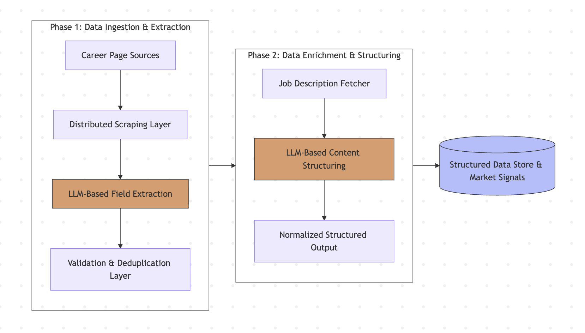

# Autonomous Job Discovery & Extraction Pipeline

A production-grade pipeline designed to autonomously discover, crawl, and extract structured job data from startup career pages using LLM-assisted parsing and automated site discovery.



## Core Capabilities
- **Automated Discovery**: Identifies startup career pages and ATS endpoints from company names using Clearbit and DuckDuckGo fallbacks.
- **Intelligent Extraction**: Uses LLM-assisted parsing (e.g., Qwen, GPT) to normalize unstructured HTML into clean job records.
- **Robust Orchestration**: Status-driven workers process data through discovery, scraping, and verification phases with full concurrency support.
- **Persistent Storage**: Full audit logs and normalized relational data stored in Supabase with automated PostgreSQL triggers.


## Pipeline Components
- `workers/import_companies.py`
  - Loads company + career-page URLs from CSV into Supabase.
- `extract_site_content.py` (Root)
  - Claims scrape jobs, fetches page HTML with Playwright, cleans/chunks content, updates `scrapes`.
- `job_extraction.py` (Root)
  - Claims cleaned scrapes, calls LLM extraction, normalizes jobs, upserts `jobs`.
- `extract_job_url_content.py` (Root)
  - Claims open jobs, fetches job URLs, stores page existence/content outcomes.
- `description_extraction.py` (Root)
  - Processes job descriptions and extracts metadata.
- `database/database.py`
  - Centralized database access and status transitions.

## Repository Structure
```text
project/
  data/                   # CSV/JSON input and output
  database/               # Core DB logic
    AI_connection/
    client.py
    database.py
  debug/                  # Debugging and testing scripts
  docs/                   # Documentation and reports
  logs/                   # System and error logs
  supabase/               # Migration and edge function logic
  workers/                # Supporting background workers
  extract_site_content.py
  job_extraction.py
  extract_job_url_content.py
  description_extraction.py
  requirements.txt
  AGENTS.md
  README.md
```

## Prerequisites
- Python 3.14+
- Playwright dependencies installed
- Supabase project URL + API key

## Setup
```bash
python3 -m venv venv
source venv/bin/activate
pip install -r requirements.txt
playwright install chromium
```

## Environment Variables
Create a local `.env` file using `.env.example`.

Required keys:
- `SUPABASE_PROJECT_URL`
- `SUPABASE_SECRET_KEY` or `SUPABASE_API_KEY`

Optional/secondary keys:
- `SUPABASE_DB_PASSWORD`
- `OLLAMA_URL`
- `GOOGLE_API_KEY`
- `GOOGLE_CSE_ID`

## Run Commands
Activate environment first:
```bash
source venv/bin/activate
```

Import companies:
```bash
python workers/import_companies.py data/test_companies.csv
```

Run site-content worker:
```bash
python extract_site_content.py
```

Run core job extraction worker:
```bash
python job_extraction.py
```

Run job-url content worker:
```bash
python extract_job_url_content.py
```

## Outputs / Storage
Primary persistent storage (Supabase):
- `career_pages`
- `scrapes`
- `jobs`
- `job_page_fetches`

## Security Notes
- Do not commit secrets/API keys.
- Keep `.env` local and use `.env.example` for required variable names.
- Ensure `.gitignore` excludes local credential files.
