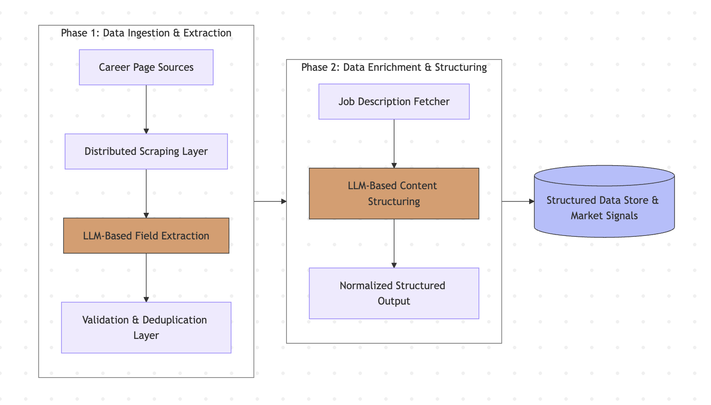

# Job Scraper & Big Data Analytics Pipeline

A production-grade pipeline designed to autonomously discover, crawl, and extract structured job data from startup career pages using LLM-assisted parsing and automated site discovery. It then performs distributed analytical processing using Apache Spark.



## Core Capabilities
- **Automated Discovery**: Identifies startup career pages and ATS endpoints from company names using Clearbit and DuckDuckGo fallbacks.
- **Intelligent Extraction**: Uses LLM-assisted parsing (e.g., Qwen, GPT) to normalize unstructured HTML into clean job records.
- **Robust Orchestration**: Status-driven workers process data through discovery, scraping, and verification phases with full concurrency support.
- **Persistent Storage**: Full audit logs and normalized relational data stored in Supabase with automated PostgreSQL triggers.

## M3 Status (Current)
- **Transactional Pipeline**: Operational (Acquisition, AI Extraction, Supabase Storage).
- **Big Data Bridge**: Implemented (Automated ETL from Supabase to Parquet Data Lake).
- **Distributed Analytics**: Implemented (PySpark-based Tech-Stack and Salary aggregations).
- **Data Lake Architecture**: Medallion-style (Bronze/Gold) storage implemented.

## Pipeline Components

### 1. Scraping & Extraction (OLTP)
- `workers/import_companies.py`: Loads company + career-page URLs from CSV into Supabase.
- `extract_site_content.py`: Fetches HTML and converts to cleaned markdown chunks.
- `job_extraction.py`: Uses LLMs to identify and normalize job listings.
- `extract_job_url_content.py`: Verifies and fetches individual job post URLs.
- `description_extraction.py`: Processes job descriptions and extracts metadata.
- `database/database.py`: Centralized database access and status transitions.

### 2. Big Data & Analytics (OLAP)
- **`database/big_data/exporter.py`**: Syncs Supabase data into a local **Parquet Data Lake** (Bronze Layer) using PySpark.
- **`analytics/spark_analytics.py`**: A **PySpark** distributed processing job.

## Repository Structure
```text
project/
  analytics/
    spark_analytics.py      <-- Distributed Processing
  data/                   # CSV/JSON input and output
  database/               # Core DB logic
    big_data/
      exporter.py           <-- ETL Bridge
    AI_connection/
    client.py
    database.py
  datalake/                 <-- Local Parquet Data Lake
    bronze/
    gold/
  debug/                  # Debugging and testing scripts
  docs/                   # Documentation and reports
  logs/                   # System and error logs
  supabase/               # Migration and edge function logic
  workers/                # Supporting background workers
  extract_site_content.py
  job_extraction.py
  extract_job_url_content.py
  description_extraction.py
  requirements.txt
  AGENTS.md
  README.md
```

## Prerequisites
- **Python 3.14+**
- **Java 11 or 17** (Required for Apache Spark)
- **Apache Spark / PySpark 3.5.0**
- Playwright & Supabase credentials

## Setup
```bash
python3 -m venv venv
source venv/bin/activate
pip install -r requirements.txt
playwright install chromium
```

## Run Commands

### 1. Data Ingestion & Scraping
```bash
python workers/import_companies.py data/test_companies.csv
```

# Run workers (Orchestrated via Supabase status states)
python extract_site_content.py
python job_extraction.py
```

### 2. Big Data Analysis
This single command automatically syncs the Data Lake from Supabase and runs the distributed Spark analytics:
```bash
python3 -m analytics.spark_analytics
```

## Outputs / Storage
- **Transactional (Supabase)**: `companies`, `career_pages`, `scrapes`, `jobs`, `scrape_log_events`.
- **Analytical (Parquet)**: Columnar storage in `datalake/` for high-volume distributed access.

## Security
- Secrets are managed via `.env` (excluded from git).
- All Big Data processing is local-mode to ensure data privacy.
