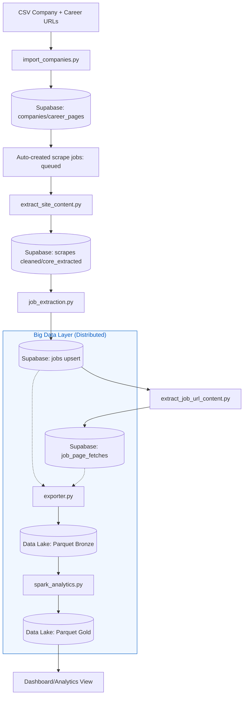

# Architecture: Big Data Integration

## Current Implementation Snapshot
This diagram reflects the full pipeline, incorporating the distributed processing layer.

## Component Status Matrix
| Component | Status | Notes |
|---|---|---|
| Company URL import | Implemented | `import_companies.py` inserts companies + career pages. |
| Scrape claiming/fetching | Implemented | `extract_site_content.py` claims queued jobs and stores cleaned content. |
| LLM job extraction | Implemented | `job_extraction.py` extracts and upserts normalized jobs. |
| Job page verification | Implemented | `extract_job_url_content.py` records fetch outcomes. |
| **Data Lake Bridge** | **Implemented** | `exporter.py` syncs Supabase to Parquet (Bronze Layer). |
| **Distributed Analytics** | **Implemented** | `spark_analytics.py` performs large-scale aggregations (Gold Layer). |

## M2 to M3 Diff
- **Distributed Layer**: Introduced Apache Spark (PySpark) for analytical workloads.
- **Storage**: Added Parquet-based Data Lake to handle high-volume data outside of relational constraints.
- **Aggregations**: Implemented tech stack, salary, and system-health analytics at scale.
